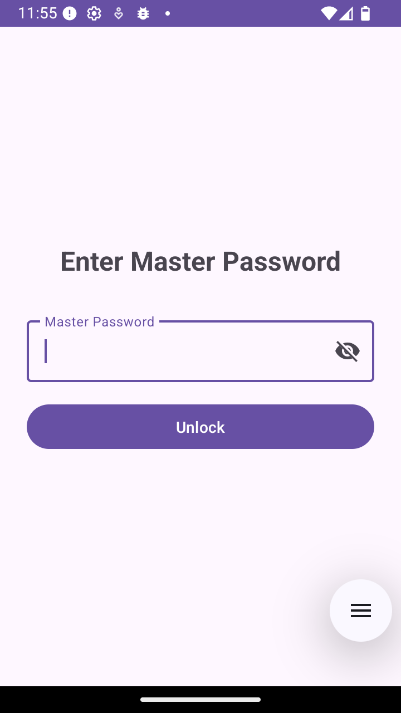
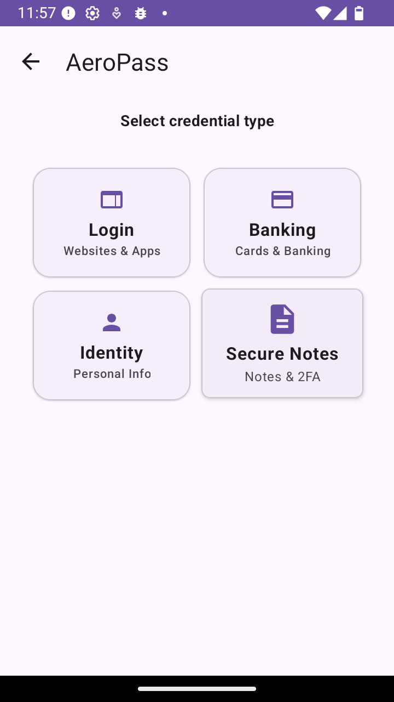
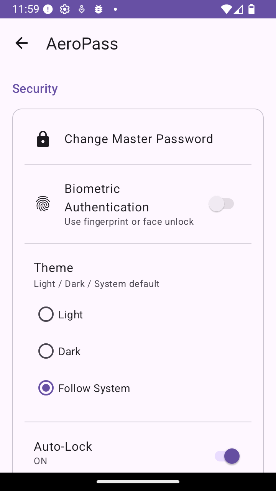

# AeroPass: Secure Password Manager

AeroPass is a comprehensive secure password manager for Android that helps you store and manage your passwords and other sensitive information securely. It uses strong encryption to protect your data and offers a variety of features to help you stay secure online.

## Features

### Core Security Features
*   **Secure Credential Storage:** Store your login credentials, payment information, identity documents, and secure notes in an encrypted vault.
*   **Strong Encryption:** Your data is encrypted using AES-256 encryption to protect it from unauthorized access.
*   **Master Password:** Access your vault with a single master password. Your master password is the only key that can decrypt your data.
*   **Biometric Authentication:** Use your fingerprint or face to unlock your vault quickly and securely.
*   **Auto-Lock:** Automatically lock your vault after a certain period of inactivity.

### Credential Management
*   **Multiple Credential Types:** Support for four types of credentials:
    - **Login Credentials:** Website and app login details with username/email, password, URL, and recovery information
    - **Payment Information:** Credit/debit card details, bank account information, and billing addresses
    - **Identity Documents:** Personal identification documents with full name, document details, and issuing authority
    - **Secure Notes:** Encrypted notes with secret keys, QR codes, and sensitive information
*   **Smart Sharing:** Share credentials securely with type-specific formatting for all credential types
*   **Category Organization:** Organize credentials into categories (Personal, Work, Family, etc.)
*   **Search & Filter:** Quickly find credentials with search and category filtering

### User Experience
*   **Streamlined Forms:** Simplified credential entry forms with essential fields only
*   **Secure Clipboard:** Copy sensitive information with automatic clipboard clearing
*   **Import/Export:** Import and export your data from JSON files with support for multiple formats
*   **Material Design:** Modern, intuitive interface following Material Design guidelines

## Screenshots

| Login Screen | Home Screen | Settings Screen |
| :---: | :---: | :---: |
|  |  |  |

## Getting Started

To get started with AeroPass, you'll need to have Android Studio installed on your computer. Once you have Android Studio installed, you can clone the project from GitHub and open it in Android Studio.

```bash
git clone https://github.com/fahadrayhan/aeropass.git
```

Once you have the project open in Android Studio, you can build and run the app on your Android device or emulator.

## Built With

*   [Kotlin](https://kotlinlang.org/) - The primary programming language for the app.
*   [Android Jetpack](https://developer.android.com/jetpack) - A suite of libraries to help developers follow best practices, reduce boilerplate code, and write code that works consistently across Android versions and devices.
    *   [View Binding](https://developer.android.com/topic/libraries/view-binding) - A feature that allows you to more easily write code that interacts with views.
    *   [ViewModel](https://developer.android.com/topic/libraries/architecture/viewmodel) - A class that is responsible for preparing and managing the data for an `Activity` or a `Fragment`.
    *   [LiveData](https://developer.android.com/topic/libraries/architecture/livedata) - A data holder class that can be observed within a given lifecycle.
    *   [Room](https://developer.android.com/topic/libraries/architecture/room) - A persistence library that provides an abstraction layer over SQLite to allow for more robust database access while harnessing the full power of SQLite.
*   [Material Components for Android](https.com/material-components/material-components-android) - Modular and customizable Material Design UI components for Android.
*   [Coroutines](https://kotlinlang.org/docs/reference/coroutines-overview.html) - A concurrency design pattern that you can use on Android to simplify code that executes asynchronously.

## Data Import Format

AeroPass supports importing data from JSON files. Use the following format to import your existing credentials:


### Field Descriptions

- **version**: Format version (use "1.0")
- **exportDate**: ISO 8601 timestamp of export
- **credentials**: Array containing all credential objects
- **id**: Unique identifier for each credential
- **title**: Display name for the credential
- **credentialType**: One of: LOGIN, PAYMENT, IDENTITY, SECURE_NOTES
- **encryptedData**: JSON string containing the actual credential data (unencrypted - app will encrypt during import)
- **category**: Category name (Personal, Work, Family, etc.)
- **dateCreated/lastUpdated**: Unix timestamps in milliseconds

### Supported encryptedData Fields by Type

#### LOGIN Credentials
- **username**: Login username
- **password**: Login password
- **url**: Website URL

#### PAYMENT Credentials
- **cardNumber**: Credit/debit card number
- **cardholderName**: Name on the card
- **expirationDate**: Card expiration date (MM/YY format)

#### IDENTITY Credentials
- **fullName**: Full legal name
- **nationalId**: National ID or document number
- **dateOfBirth**: Date of birth (YYYY-MM-DD format)

#### SECURE_NOTES Credentials
- **noteContent**: The secure note text
- **secretKey**: Associated secret key or code

### Legacy Format Support


- **websiteName**: Name of the website or service (converted to title)
- **encryptedPassword**: The encrypted password data (converted to LOGIN credential)

Legacy credentials will be automatically converted to the new LOGIN credential format during import.

### How to Import

1. Save your data in the JSON format above
2. Go to Settings → Import Data in the app
3. Select your JSON file
4. The app will automatically detect and import all credential types

## Author

*   **Fahad Rayhan** - [https://github.com/fahadrayhan](https://github.com/fahadrayhan)
